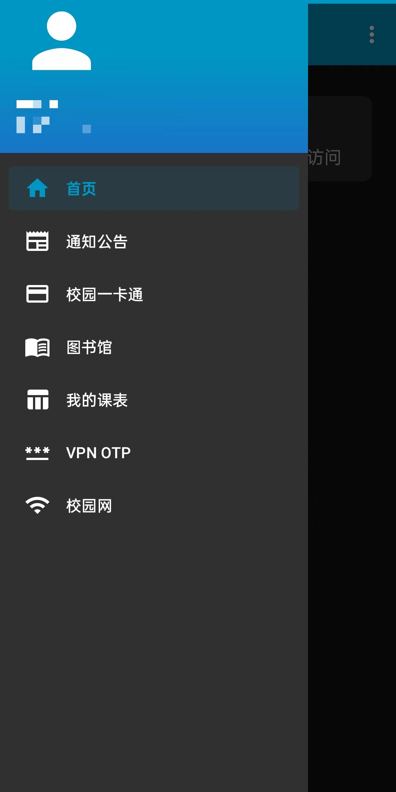
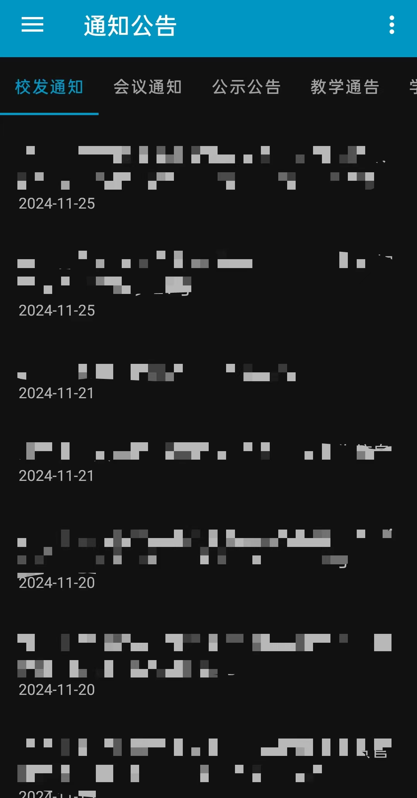
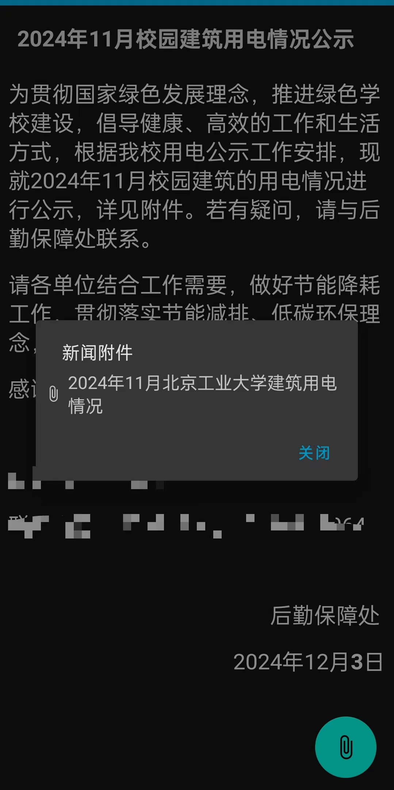
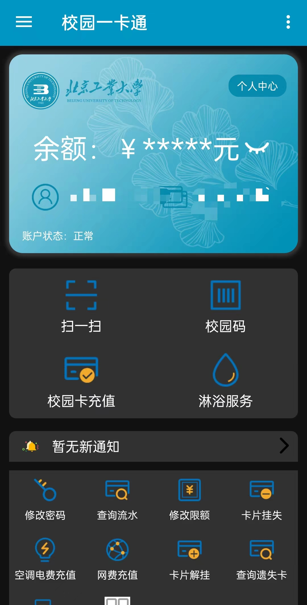
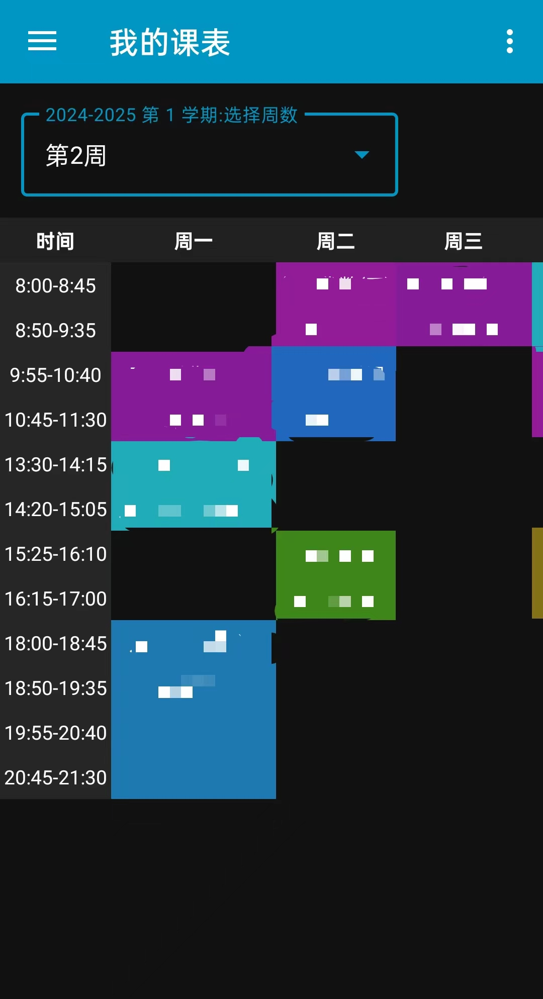

  

# bjut app

日新工大第三方安卓版本，本APP是非官方的，免费开源的，功能实现完全依赖官方接口，个人数据仅保存在本地。初衷是集成北京工业大学 (BJUT) 所有有用的学生端线上功能，本应用后续不定期更新，如果觉得好用请点个Star吧。

注：本APP无意冒充官方日新工大，请认真辨别，禁止用于非法用途。

## 计划支持的功能

* [x] 课程表查看
* [x] 校园一卡通服务
* [x] 新闻查看
* [x] WEBVPN集成
* [x] 集成校内VPN动态otp验证码 (特色)
* [x] 桌面APP长按快捷菜单
* [x] 图书馆相关功能
* [x] 校内WiFi一键登录
* [ ] 校内邮箱浏览
* [ ] 办事大厅
* [ ] 重要消息提示
* [ ] 燕小北AI
* [ ] 新闻附件直接预览

## 应用编写说明

本代码使用Android Studio kotlin编写，使用了一些安卓原生组件，相比官版日新工大，此应用优化了一些数据的缓存逻辑，整体界面使用类Google Material风格设计，且适配了系统的暗色主题，部分页面依赖于系统WebView。

## 应用兼容性说明

本app完全支持armeabi-v7a, arm64-v8a, x86和x86_64安卓架构，理论上较好支持Android 7.1+版本 (Android API level 25)。

## 应用内部分截图

  
  
  
  
  

## 应用帮助说明

[OTP导入说明](./docs/otpdb/README.md)

## 提出建议

如果遇到BUG或者有针对此APP的意见，可建立一个Issue，并注意附上完整清晰的情况说明。