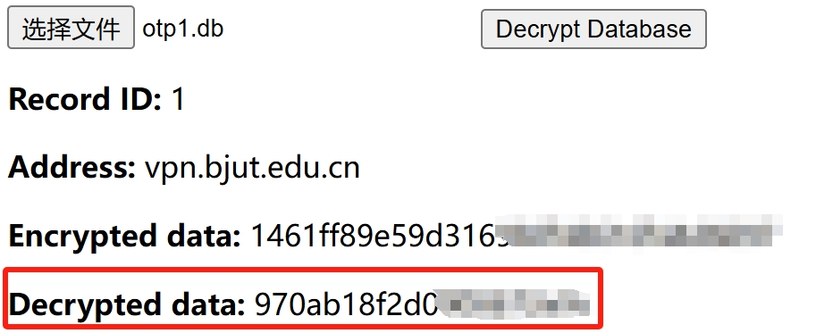

# OTP导入说明

本APP使用的OTP data为一个长度为20的字符串，且仅由数字和小写字母组成。

## OTP data的备份恢复

在OTP界面中可以点击“查看DATA”按钮，查看当前本地的data，并将其复制下来保存好。之后如需要恢复备份，点击“手动导入”按钮，粘贴已有的备份data，就可以恢复OTP data。

## 使用root提取现有MotionPro OTP的数据

由于如果曾经已在MotionPro OTP应用中注册过设备，则在线下去信息楼重置之前，无法在本应用重复注册。
如果**手机已有root权限**，并且具有一定的动手能力，可以通过以下步骤从MotionPro OTP中提取OTP data：

1. 使用可以利用root权限的文件管理器（如MT管理器），将根目录下/data/data/com.arraynetworks.authentication/databases/otp.db文件拷贝出来。
2. 下载并打开此目录下提供的otpdb.html网页文件（或者使用[在线页面](https://bjutapp.0xee.cf/otpdb.html)），选择提取的otp.db文件，再点击"Decrypt Database"按钮，展示的内容中，最后一行"Decrypted data"所示的内容即为需要的数据，将这个长为20的字符串导入本应用即可。

